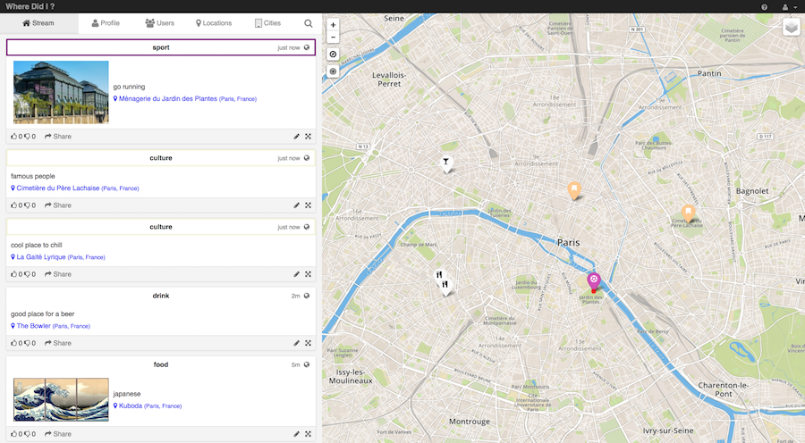

## Foursquare meets Instagram

With friends we wanted to have a platform where we could easily share geolocalized life events to each other or publicly. We felt Instagram or Facebook had too much overhead, and Foursquare or Yelp were only focused on bars & restaurants.

Where could you share a photo of an interesting exhibition, and the next day pinpoint a cool street-art in your neighborhood ?

The long term vision was to aggregate the data per street/neighborhood/city/country, adding pages for each of these and providing interesting statistics & recommendations for users, with privacy in mind.

We were a team of 2 developers, building the website and a mobile application. We learned web development along the way. A great challenge and lots of coding hours :)

## Tech

- stack: Angular.js & Python/Django, OpenStreetMap API
- hosting: own server
