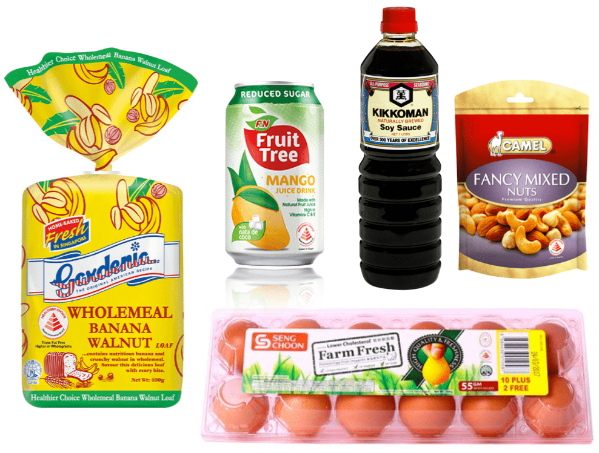

## Food in Singapore

[Redmart](https://redmart.lazada.sg/#home) is an online grocery store in Singapore. We use it to order bulky and non-fresh items, approximately every 2 months. It's convenient, there's not many supermarkets close to where we live, and the items are delivered at your door. We nevertheless still buy other products offline (fruits and vegetables especially).

After a couple of orders, I started to get curious about our ordering patterns: which products and brands we bought the most, where these products were coming from, if there were any closer/local alternatives, etc.

Singapore is a (very) small country, more than 90% of it's food is imported ([source]((https://www.channelnewsasia.com/news/singapore/singapore-produce-30-own-food-up-from-10-nutritional-needs-11320426))). There are some urban farms, and some products are also baked or 'assembled' in Singapore. But most of what we buy is imported from neighboring Malaysia, Thailand, China, and Australia. And if I were to buy French products, well they most likely would be coming from France :)

_Examples of products 'Made in Singapore'_

## Product informations

WIP (barcodes, labels (Healthier Choice Singapore), database, apis, Open Food Facts)

## Demo

WIP: https://observablehq.com/@raphodn/openfoodfacts-x-redmart

Also a couple of Python Notebooks for interacting with the Redmart & Open Food Facts APIs.

## Go further

- [Edible Garden City](https://www.ediblegardencity.com/)
- [Inside Singapore's Largest Egg Farm](https://www.channelnewsasia.com/news/cnainsider/inside-high-tech-operation-singapore-largest-egg-farm-seng-choon-11396776)